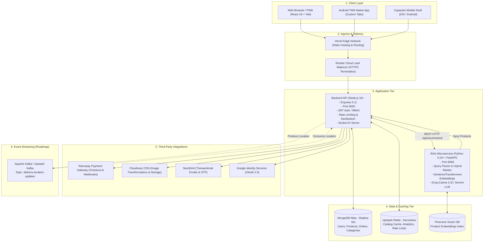
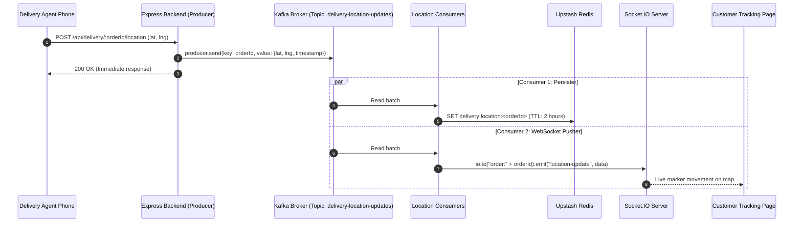

# System Architecture & Technical Specification — KripaConnect

> **Scope:** Full-Stack E-Commerce Platform, B2B Wholesale Portal, RAG Microservice, and Mobile Apps  
> **Repository Model:** Unified Monorepo  
> **Status:** Production Architecture  
> **Last Updated:** September 2026  

---

## 1. High-Level System Topology

KripaConnect is organized as a decoupled, multi-tier architecture consisting of client applications, an Express API backend, a Python/FastAPI RAG microservice, managed cloud databases, and third-party SaaS integrations.



---

## 2. Monorepo Structure & Service Boundaries

The repository follows a clean domain boundary structure:

```
SKE/                                  ← Monorepo Root
├── Doc/                              ← AI & Developer System Documentation
├── backend/                          ← Core Business API (Node.js / Express 5)
│   ├── index.js                      ← Server entrypoint (initializes DB, Redis, HTTP listener)
│   ├── src/
│   │   ├── config/                   ← Database, Redis, and Socket.IO configurations
│   │   ├── controllers/              ← HTTP route handlers (one file per domain)
│   │   ├── middleware/               ← Auth, RBAC, Helmet, rate limiting, Multer
│   │   ├── models/                   ← Mongoose ODM schemas
│   │   ├── routes/                   ← Express routers
│   │   ├── services/                 ← External integrations (Razorpay, Cloudinary, SendGrid, PDF)
│   │   └── utils/                    ← Cache helpers, token generators, response envelopes
│   ├── scripts/                      ← Database seeds and integration testing scripts
│   └── tests/                        ← Backend automated test suites
├── frontend/                         ← Client Web Application (React 19 / Vite 7)
│   ├── src/
│   │   ├── components/               ← Shared UI components (Navbar, Modals, Cards)
│   │   ├── context/                  ← React Context providers (Auth, Shop, PurchaseMode)
│   │   ├── hooks/                    ← Custom React hooks (debouncing, media queries)
│   │   ├── pages/                    ← Lazy-loaded route views
│   │   ├── services/                 ← Axios/fetch API wrappers per domain
│   │   └── styles/                   ← Modular CSS stylesheets
│   ├── capacitor.config.json         ← Capacitor mobile bridge config
│   └── vercel.json                   ← SPA rewrites and security header configuration
├── RAG_kc/                           ← Semantic AI Search Microservice (FastAPI / Python)
│   ├── app/
│   │   ├── api/                      ← FastAPI endpoint routes (admin, products, recommendations)
│   │   ├── core/                     ← Settings, config, and logging
│   │   ├── models/                   ← Pydantic schemas (requests & responses)
│   │   ├── rag/                      ← Query parser, embeddings, Pinecone store, LLM generator
│   │   └── services/                 ← Product synchronizer and ranking algorithms
│   ├── requirements.txt              ← Python dependencies
│   └── test_api.py                   ← Microservice health & end-to-end test suite
└── twa-kripa-connect/                ← Android Trusted Web Activity Project
    ├── app/                          ← Android application module
    ├── build.gradle                  ← Gradle build scripts
    └── assetlinks.json               ← Digital Asset Links for domain verification
```

---

## 3. Backend Architecture (Express 5 + Node.js)

### 3.1 Request Pipeline & Middleware Chain
Incoming HTTP requests pass through an ordered middleware pipeline before reaching controller actions:

```
[Request]
   │
   ▼
[1. Security Headers (Helmet)] ──────► Sets HSTS, CSP, X-Frame-Options
   │
   ▼
[2. CORS Configuration] ─────────────► Validates Origin against ALLOWED_ORIGINS whitelist
   │
   ▼
[3. Request Logger (Morgan)] ────────► Logs method, path, status, and duration
   │
   ▼
[4. Body Parsers] ───────────────────► express.json({ limit: '10mb' }), urlencoded, cookie-parser
   │
   ▼
[5. Input Sanitizers] ───────────────► mongo-sanitize (strips $ and .), xss (cleans strings)
   │
   ▼
[6. Rate Limiters] ──────────────────► Global limiter (100 req/15min) & Auth limiter (5 req/15min)
   │
   ▼
[7. Domain Router] ──────────────────► Matches /api/<domain>
   │
   ├──► [8a. Auth Middleware] ───────► Verifies JWT Bearer token, populates req.user
   ├──► [8b. Role Guard] ────────────► Checks req.user.role against required roles ('admin', 'retailer')
   ├──► [8c. Multer Upload] ─────────► Handles multipart/form-data for image/CSV uploads
   │
   ▼
[9. Controller Action] ──────────────► Executes business logic via Services
   │
   ▼
[10. Global Error Handler] ──────────► Formats errors into { success: false, message, error }
```

### 3.2 Database Layer (MongoDB Atlas + Mongoose)
The primary relational-like document store is MongoDB Atlas.
- **User:** Manages credentials, roles (`customer`, `retailer`, `admin`), addresses, B2B company details, and OTP verification state.
- **Product:** Contains catalog data, SKU, stock count, B2C `price`, B2B `retailer_price`, categories, tags, images, and active status.
- **Category & Subcategory:** Two-level classification hierarchy with slugified URLs.
- **Order:** Tracks items, customer reference, shipping address, financial totals, `orderStatus` state machine, payment details, and timeline history.
- **Transaction:** Immutable audit records of payment gateway transactions, Razorpay IDs, amounts, and statuses.
- **Review:** Product ratings (1–5 stars) with user comments and admin moderation flags.
- **Banner:** Promotional hero banners with target links and active date ranges.

### 3.3 Caching Architecture (Upstash Redis)
The backend implements a **Cache-Aside (Lazy Loading)** strategy using the `@upstash/redis` REST client in [`backend/src/utils/cacheUtils.js`](file:///c:/Users/Kunal/Desktop/Projects/SKE/backend/src/utils/cacheUtils.js).

| Cache Key Pattern | Target Data | Default TTL | Invalidation Trigger |
|---|---|---|---|
| `products:list:*` | Filtered & paginated product listings | 300 seconds (5 min) | Product Create/Update/Delete, Stock change |
| `product:details:<id>` | Single product document with populated category | 600 seconds (10 min) | Product Update/Delete |
| `categories:all` | Complete category and subcategory tree | 3600 seconds (1 hour) | Category/Subcategory Create/Update/Delete |
| `analytics:summary` | Admin dashboard overview metrics | 300 seconds (5 min) | New Order placed or status modified |

- **Resilient Fallback:** If Upstash Redis credentials are unset or the network fails, `cacheUtils.js` gracefully bypasses the cache and executes direct MongoDB queries without throwing errors.

---

## 4. Frontend Architecture (React 19 + Vite 7)

### 4.1 Routing & Code-Splitting
The frontend utilizes **React Router v7** with lazy-loaded route components wrapped in `<Suspense fallback={<AppLoader />}>`:

- **Public Routes:** `/`, `/products`, `/product/:id`, `/categories`, `/favorites`, `/cart`, `/about`, `/services`, `/faq`, `/contact`, `/privacy`, `/terms`, `/returns`, `/download`.
- **Auth Routes:** `/login`, `/signup`, `/forgot-password`, `/reset-password`.
- **Protected Customer Routes:** `/checkout`, `/success/:orderId`, `/profile`, `/onboarding`, `/orders`, `/orders/:id`.
- **Role-Guarded B2B Routes:** `/b2b` (requires `role: 'retailer'`).
- **Role-Guarded Admin Routes:** `/admin` (requires `role: 'admin'`).

### 4.2 State Management via Context API
1. **`AuthContext`:**
   - Holds `user`, `token`, `isAuthenticated`, and `loading` state.
   - Manages login, registration, Google OAuth, OTP verification, and logout.
   - Automatically handles token refresh cycles and cross-tab synchronization.
2. **`ShopContext`:**
   - Controls shopping cart items, quantities, subtotal calculation, and wishlist/favorites.
   - Synchronizes cart state with backend API when logged in and localStorage when guest.
3. **`PurchaseModeContext`:**
   - Controls retail (`b2c`) vs wholesale (`b2b`) pricing displays and minimum order quantity (MOQ) rules.

### 4.3 PWA, TWA, and Mobile Bridges
- **PWA Service Worker:** Pre-caches static application assets (`index.html`, JavaScript chunks, CSS) and provides an offline fallback page.
- **Android TWA (Trusted Web Activity):**
  - Renders the production PWA in a Chrome Custom Tab without URL address bars.
  - Domain association verified through `/.well-known/assetlinks.json` containing the SHA-256 fingerprint of the release keystore.
- **Capacitor Configuration:** Configured in `frontend/capacitor.config.json` with `appId: 'in.kripaconnect.app'` for packaging into standalone APKs or iOS bundles.

---

## 5. RAG Recommendation Microservice Architecture (`RAG_kc`)

The RAG service is an independent Python service built on **FastAPI 0.111.0**.

### 5.1 Pipeline Execution Flow
```
User Query: "breathable cotton shirts under 1000 for office"
   │
   ▼
[1. Query Parser (app/rag/query_parser.py)]
   ├─ Extracts price filters: max_price = 1000
   ├─ Extracts category intent: "shirts"
   └─ Cleans semantic text: "breathable cotton shirts office"
   │
   ▼
[2. Embeddings Generator (app/rag/embeddings.py)]
   └─ Generates 384-dimensional dense vector via SentenceTransformers ('all-MiniLM-L6-v2')
   │
   ▼
[3. Vector Store Retrieval (app/rag/pinecone_store.py)]
   ├─ Queries Pinecone Index with vector + metadata filter (price <= 1000)
   └─ Fallback: Local cosine similarity vector search if Pinecone is offline
   │
   ▼
[4. Hybrid Re-Ranking (app/services/hybrid_ranker.py)]
   └─ Blends vector similarity score (70%) with lexical keyword match score (30%)
   │
   ▼
[5. LLM Answer Synthesis (app/rag/generator.py)]
   ├─ Assembles prompt with top candidate product metadata
   ├─ Calls Groq API (Llama 3.3 70B Versatile) or Google Gemini Flash
   └─ Generates concise, persuasive recommendation reasoning:
      - answer summary
      - why_recommended per item
      - product comparison table
```

### 5.2 Microservice Resiliency & Proxying
In [`backend/src/controllers/recommendationController.js`](file:///c:/Users/Kunal/Desktop/Projects/SKE/backend/src/controllers/recommendationController.js):
- Frontend calls `POST /api/recommend` on Express.
- Express attempts to forward the query to `RAG_SERVICE_URL` with a strict `3500ms` timeout.
- If the RAG service responds within 3.5s, the enriched LLM recommendation is returned.
- If the RAG service times out or errors, Express triggers `fallbackDatabaseRecommendations()`, executing a MongoDB regex search over product names, descriptions, and tags.

---

## 6. Event-Driven Delivery Tracking Architecture (Kafka Roadmap)

As specified in `Tracker_Kafka.md`, the platform is architected to support real-time delivery agent GPS tracking:



---

## 7. Security & Compliance Architecture

1. **Authentication Token Lifecycle:**
   - Access tokens are signed with `JWT_SECRET` (HS256) and expire in 15 minutes.
   - Refresh tokens are signed with `JWT_REFRESH_SECRET` (HS256) and expire in 7 days.
   - Refresh tokens are transmitted strictly via `httpOnly` cookies, preventing XSS extraction.
2. **Payment Verification Security:**
   - Razorpay payment success is verified on the backend by calculating:
     `HMAC-SHA256(order_id + "|" + razorpay_payment_id, RAZORPAY_KEY_SECRET)`
   - Only matching signatures update the order to `paid` status.
3. **Database Injection Protection:**
   - `mongo-sanitize` intercepts all `req.body`, `req.query`, and `req.params`, stripping malicious operators like `$gt`, `$ne`, and `$where`.
4. **Content Security Policy (CSP):**
   - Configured via Helmet to only allow trusted script execution, style loading, and media sources (Cloudinary, Razorpay, Google OAuth).
