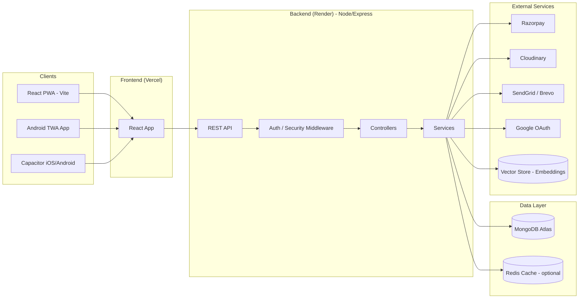
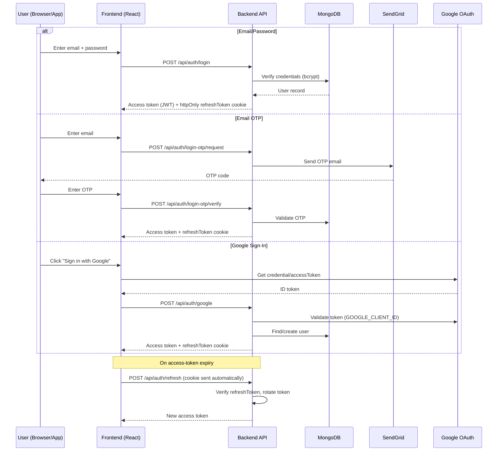
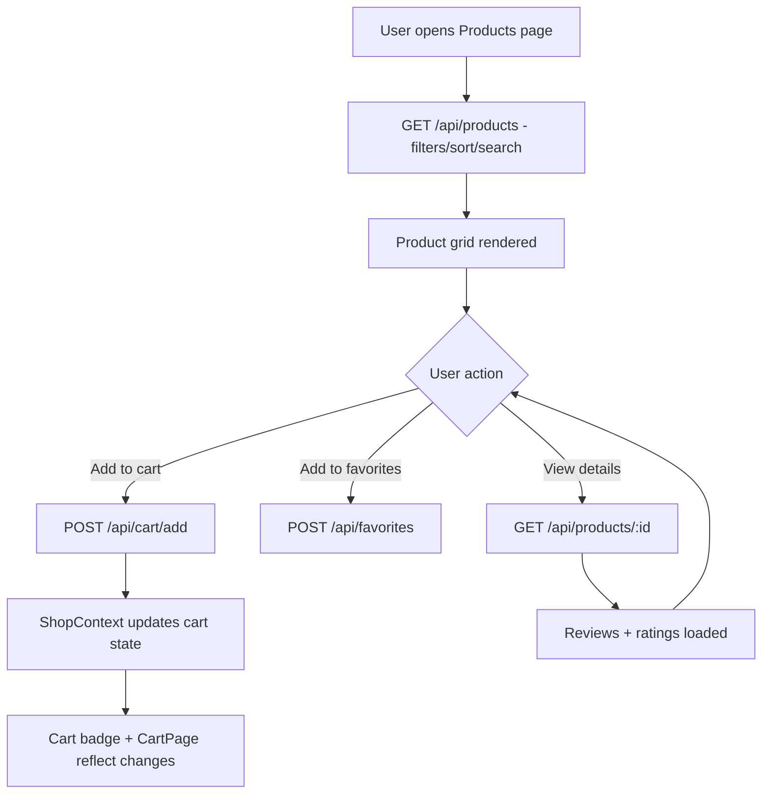
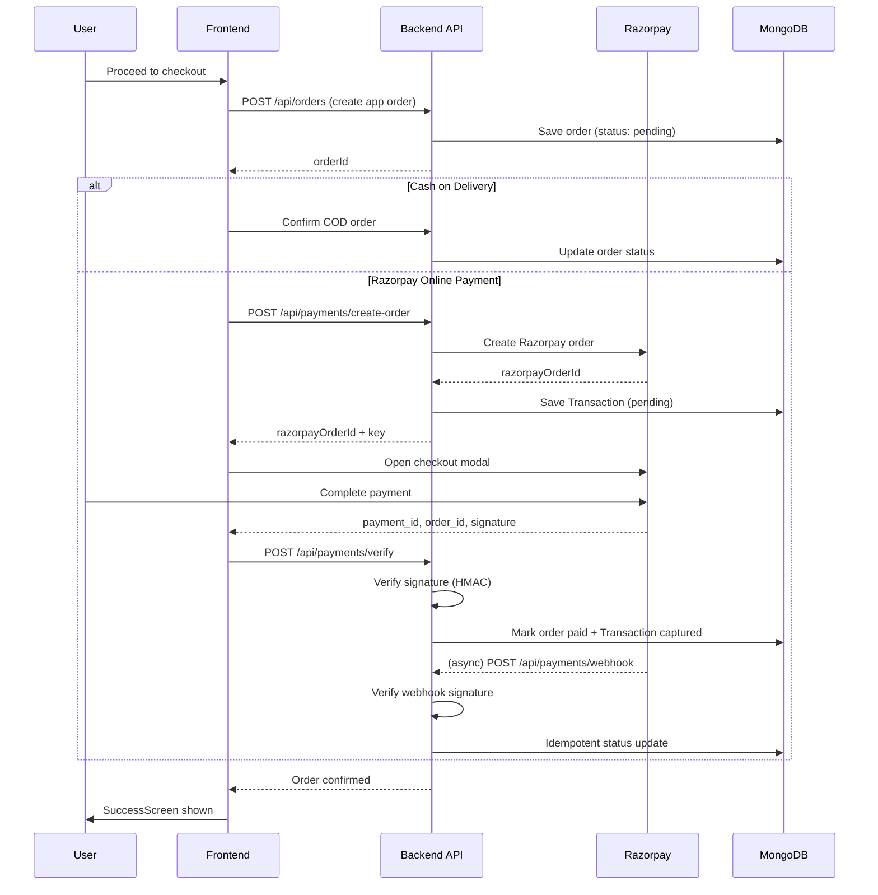
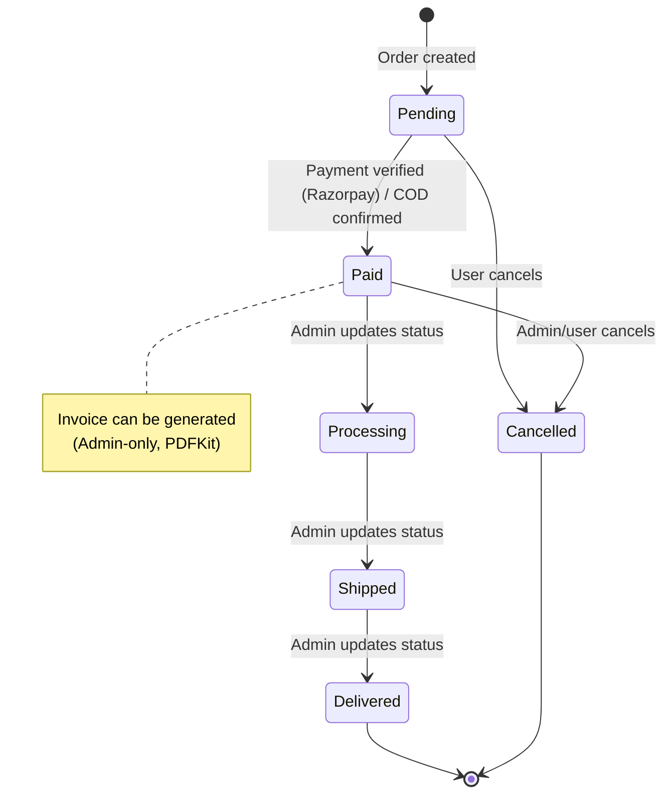
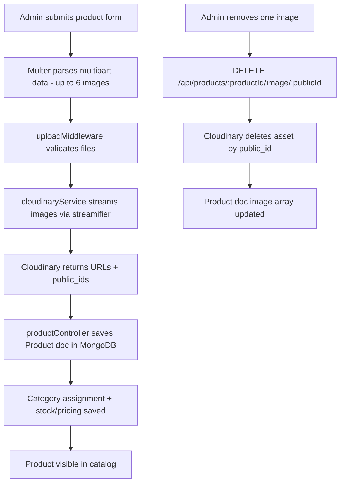
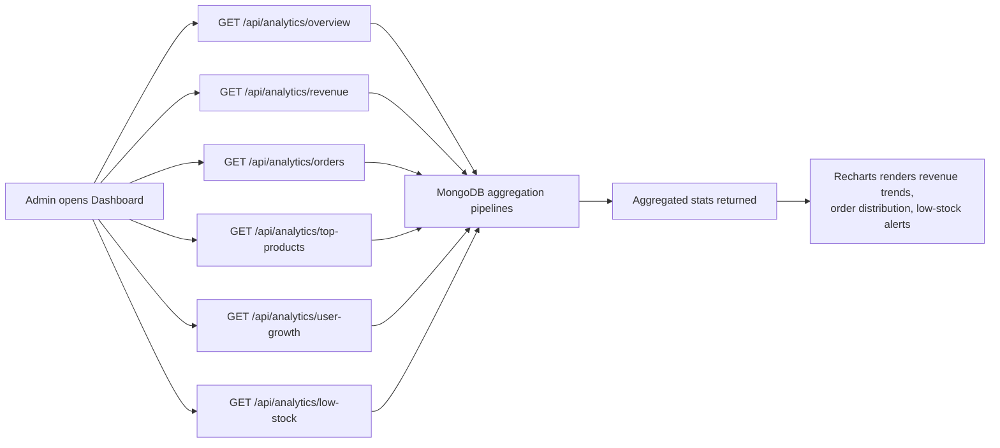
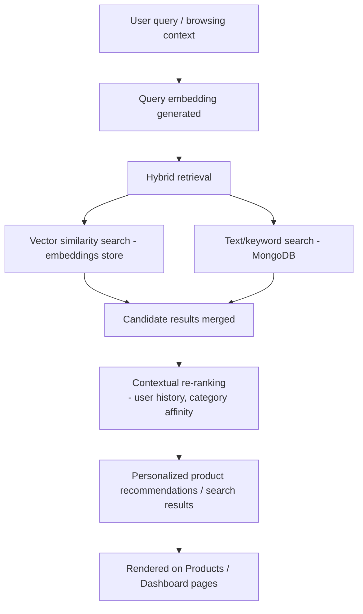
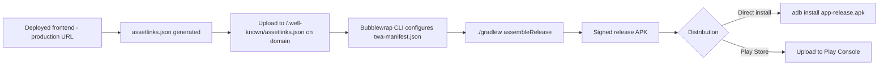

# KripaConnect — Full Stack E-Commerce Platform

A complete e-commerce solution with web and mobile support, featuring a modern React frontend, a robust Node.js backend, and a native Android app via Trusted Web Activity (TWA).

**Monorepo containing:**

- **Backend**: Node.js + Express + MongoDB REST API
- **Frontend**: React + Vite (PWA-ready)
- **Mobile App**: Capacitor (iOS/Android) + TWA Android build

This comprehensive platform includes customer shopping, a B2B retailer portal, and a full-featured admin dashboard with analytics.

---

## Table of Contents

- [System Overview](#system-overview)
- [Project Structure](#project-structure)
- [Key Features](#key-features)
  - [Backend Features](#backend-features)
  - [Frontend Features](#frontend-features)
- [Tech Stack](#tech-stack)
- [Core Workflows](#core-workflows)
  - [Authentication Flow](#1-authentication-flow-jwt--refresh--otp--google)
  - [Product Browsing & Cart Flow](#2-product-browsing--cart-flow)
  - [Checkout & Payment Flow (Razorpay)](#3-checkout--payment-flow-razorpay)
  - [Order Lifecycle](#4-order-lifecycle)
  - [Admin Product & Image Upload Flow](#5-admin-product--image-upload-flow)
  - [Admin Analytics Flow](#6-admin-analytics-flow)
  - [RAG Search & Recommendation Flow](#7-rag-search--recommendation-flow)
  - [Mobile App (TWA) Build & Distribution Flow](#8-mobile-app-twa-build--distribution-flow)
- [Run Locally](#run-locally)
  - [Backend Setup](#backend-setup)
  - [Frontend Setup](#frontend-setup)
- [Environment Variables](#environment-variables)
  - [Backend `.env`](#backend-env)
  - [Frontend `.env`](#frontend-env)
- [Backend API Overview](#backend-api-overview)
- [Security Notes](#security-notes)
- [Useful Scripts](#useful-scripts)
- [Mobile App (Android TWA)](#mobile-app-android-twa)
- [Deployment](#deployment)
- [Project Status & Roadmap](#project-status--roadmap)
- [License](#license)

---

## System Overview

KripaConnect is a full-stack e-commerce platform for B2C customers and B2B retailers. It's built with a React PWA/TWA frontend and a Node.js/Express backend (MongoDB, optional Redis), implementing role-based JWT auth (access + httpOnly refresh), Google + email-OTP login, secure input sanitization and rate limiting, Razorpay payments with webhook verification, PDF invoicing, a Cloudinary image pipeline, and transaction audit trails. It also includes a RAG-based search and smart recommendation pipeline using hybrid vector + text search with contextual re-ranking. It's deployed on Vercel (frontend) and Render (backend), with an architecture that's container/AWS-ready and maps easily to Next.js/Nest.js, MySQL, and AWS workflows.

**Technical highlights:**

- **Modern JS stack**: React (lazy-loading, PWA/TWA) + Node/Express APIs.
- **Auth & security**: Dual JWT flow, Google OAuth, email OTP, Helmet, mongo-sanitize, per-route rate limits.
- **Payments & integrations**: Razorpay order + signature verification, webhooks, Brevo emails, Cloudinary.
- **Search & recommendations**: RAG retrieval with embeddings + hybrid vector/text search and contextual re-ranking for personalized suggestions.
- **Data & caching**: Mongoose models (users/products/orders/reviews), optional Redis caching; idempotent webhook handling and audit logs.
- **Ops-ready**: Vercel/Render deployment, Docker/container friendly, ready for AWS/ECS/EKS and MySQL/Nest.js migrations.
- **Collaboration**: tests/seed scripts, documentation, and API-first design for team development.

### High-Level Architecture



---

## Project Structure

```txt
SKE/
  backend/
    index.js
    package.json
    data/
      products.json              # Sample product data
    scripts/
      checkPaymentStatus.js      # Payment verification utility
      seedData.js                # Database seeding script
      testRazorpay.js           # Razorpay integration test
      testSendgridEmail.js      # Email service test
    src/
      server.js
      config/
        db.js                    # MongoDB connection
      controllers/
        adminController.js
        adminOrderController.js
        analyticsControllers.js
        authController.js
        cartController.js
        categoryController.js
        favoriteController.js
        invoiceController.js
        orderController.js
        passwordResetController.js
        paymentController.js
        productController.js
        retailerOrderController.js
        reviewController.js
      middleware/
        authMiddleware.js        # JWT + role-based protection
        errorHandler.js
        security.js              # Helmet, rate limiting, sanitization
        uploadMiddleware.js      # Multer image uploads
        validate.js
      models/
        Category.js
        Order.js
        Product.js
        Review.js
        Transaction.js
        User.js
      routes/
        adminRoutes.js
        analyticsRoutes.js
        authRoutes.js
        cartRoutes.js
        categoryRoutes.js
        favoriteRoutes.js
        invoiceRoutes.js
        orderRoutes.js
        paymentRoutes.js
        productRoutes.js
        retailerRoutes.js
        reviewRoutes.js
      services/
        cloudinaryService.js     # Image storage
        emailService.js          # SendGrid integration
        invoiceService.js
        pdfService.js            # PDFKit invoice generation
        razorpayService.js       # Payment gateway
      validations/
        authValidations.js
        orderValidations.js
      validators/
        ProductValidator.js
  frontend/
    package.json
    vite.config.js
    capacitor.config.json        # Mobile app configuration
    public/
    src/
      App.jsx
      main.jsx
      index.css
      pages/                     # All route components
        Dashboard.jsx            # Home page
        Login.jsx
        Signup.jsx
        ForgotPassword.jsx
        ResetPassword.jsx
        Products.jsx
        ProductDetails.jsx
        Categories.jsx
        Favorites.jsx
        CartPage.jsx
        CheckoutPage.jsx
        SuccessScreen.jsx
        ProfilePage.jsx
        OnboardingPage.jsx
        OrdersPage.jsx
        OrderDetailsPage.jsx
        B2B.jsx                  # Retailer dashboard
        Admin.jsx                # Admin panel shell
        admin/
          AdminDashboard.jsx     # Analytics & overview
          ProductManagement.jsx
          OrderManagement.jsx
          UserManagement.jsx
          ReviewModeration.jsx
        About.jsx
        Services.jsx
        FAQ.jsx
        Contact.jsx
        Privacy.jsx
        Terms.jsx
        Refund.jsx
        NotFound.jsx
      components/
        Navbar.jsx
        Footer.jsx
        ProtectedRoute.jsx
        OrderTimeline.jsx
        AddressForm.jsx
        FavoritesButton.jsx
        FiltersSidebar.jsx
        AppToaster.jsx           # Toast notifications
        ... (more components)
      context/
        AuthContext.jsx          # Global auth state
        ShopContext.jsx          # Cart & shop state
      hooks/
        useAuth.js
        ... (more hooks)
      services/
        api.js                   # Base API client
        auth.js
        admin.js
        products.js
        categories.js
        cart.js
        orders.js
        payments.js
        favorites.js
        reviews.js
  twa-kripa-connect/            # Native Android TWA build
    app/
      build.gradle
      src/
    assetlinks.json             # Digital Asset Links for TWA
    BUILD_DOCUMENTATION.md
    INSTALLATION_GUIDE.md
    UPLOAD_INSTRUCTIONS.md
    twa-manifest.json
```

---

## Key Features

### Backend Features

The backend is a REST API built with Express and MongoDB.

**Authentication & Accounts**
- Email/password authentication using JWT access tokens.
- Refresh-token flow using an `httpOnly` cookie (`refreshToken`).
- Google OAuth sign-in endpoint (supports either `credential` ID token or `accessToken`).
- Password reset via email link (SendGrid).
- Passwordless login via **Email OTP** (request + verify endpoints).
- Profile management:
  - Fetch profile (`/api/auth/profile`)
  - Update profile details (name/phone)
  - Upload profile photo to Cloudinary
  - Save/update default shipping address (`savedAddresses`)

**Catalog / Commerce**
- Product management:
  - Public product list + product details
  - Admin create/update/delete
  - Multi-image upload (up to 6 images) using Multer + Cloudinary
  - Remove a single product image by Cloudinary `public_id`
- Category management (CRUD endpoints exist under `/api/categories`).
- Favorites (wishlist) endpoints under `/api/favorites`.
- Cart endpoints under `/api/cart`.
- Reviews endpoints under `/api/reviews`.

**Orders**
- Create order, list "my orders", and order detail.
- Cancel order (user) and update delivery status (admin).
- Admin delete order.

**Payments (Razorpay)**
- Create Razorpay order for an existing app order (`/api/payments/create-order`).
- Verify payment signature (`/api/payments/verify`).
- Razorpay webhook handler (`/api/payments/webhook`) to mark payments captured/failed.
- Transaction tracking in MongoDB (stores Razorpay order/payment ids and payload for auditing).

**Invoices**
- Admin-only invoice generation for an order (`/api/invoices/:orderId`).
- Uses PDF generation utilities (PDFKit) via backend services.

**Analytics (Admin-only)**
- Overview, revenue stats, order stats, top products, user growth, and low-stock endpoints under `/api/analytics`.

**Admin Panel Support**
- User management:
  - List users
  - Block/unblock user
  - Update user role
  - Delete user
  - Stats endpoint
- Order management:
  - All orders list, order detail, retailer orders view
  - Update order status
  - Delete order

**Operational / Platform**
- CORS allowlist + support for Vercel preview deployments (`*.vercel.app`).
- Health check homepage (`GET /`) with server stats.
- Lightweight machine health endpoint (`GET /healthz`) for monitors.
- Cron-safe ping endpoint (`GET /api/cron/ping`) for services like cronjob.org.
  - Optional protection: set `CRON_SECRET` and call `/api/cron/ping?key=YOUR_SECRET`.

---

### Frontend Features

The frontend is a modern React + Vite application with comprehensive routing, authentication, and role-based access control.

**Public Pages**
- **Home/Dashboard**: Hero section, featured products, categories, special offers
- **Products**: Product listing with advanced filtering, sorting, and search
- **Product Details**: Multi-image gallery, reviews, ratings, add to cart/favorites
- **Categories**: Browse products by category
- **Favorites**: Wishlist management
- **Cart**: Shopping cart with quantity updates and price calculations
- **Information Pages**: About, Services, FAQ, Contact, Privacy Policy, Terms & Conditions, Refund Policy

**Authentication & Onboarding**
- **Sign Up**: Email/password registration
- **Login**: Multiple login options:
  - Email/password authentication
  - **Email OTP** passwordless login
  - **Google Sign-In** integration
- **Password Recovery**: Forgot password with email reset link
- **Onboarding Flow**: First-time users set up shipping address
- Auto-redirect logic for users without saved addresses

**Customer Features (Protected Routes)**
- **Profile Management**:
  - Update personal information
  - Upload profile photo
  - Manage multiple shipping addresses
  - View account statistics
- **Checkout Process**:
  - Multi-step checkout flow
  - Address selection/creation
  - Payment method selection (COD or Razorpay)
  - Order review and confirmation
- **Order Management**:
  - Order history with status tracking
  - Detailed order view with timeline
  - Order cancellation
  - Invoice download (when available)
- **Shopping Experience**:
  - Real-time cart updates
  - Favorites/wishlist management
  - Product reviews and ratings

**B2B Retailer Dashboard (`/b2b`)**
- Retailer-specific order management
- Bulk order tracking
- Time-period filters (This Month, Last 3 Months, All Time)
- Order statistics and analytics
- Spending insights

**Admin Panel (`/admin`)**
- **Dashboard**:
  - Real-time statistics (revenue, orders, users, low stock)
  - Interactive charts (revenue trends, order distribution)
  - Low stock product alerts
- **Product Management**:
  - Create/edit/delete products
  - Multi-image upload and management
  - Category assignment
  - Stock and pricing management
- **Order Management**:
  - View all orders with filtering
  - Update order status
  - Order timeline visualization
  - Delete orders
- **User Management**:
  - List all users
  - Block/unblock accounts
  - Change user roles
  - User statistics
- **Review Moderation**:
  - View all product reviews
  - Approve/reject reviews
  - Manage customer feedback

**Payment Integration**
- **Cash on Delivery (COD)** support
- **Razorpay Online Payment**:
  - Integrated checkout modal
  - Payment verification
  - Automatic order status updates
  - Transaction tracking

**UI/UX Features**
- **Responsive Design**: Mobile-first approach, works on all devices
- **Dark/Light Mode**: Theme support via CSS variables
- **Toast Notifications**: Real-time feedback for user actions (React Hot Toast)
- **Loading States**: Skeleton screens and spinners for better UX
- **Form Validation**: Client-side validation with helpful error messages
- **Icon System**: React Icons for consistent iconography
- **Charts & Analytics**: Recharts for data visualization (admin dashboard)
- **Lazy Loading**: Code splitting for optimal performance
- **Protected Routes**: Role-based route protection (customer/retailer/admin)

**Progressive Web App (PWA)**
- PWA-ready with manifest and service worker support
- App-like experience on mobile devices
- Offline capability (when configured)
- Add to home screen support

**Mobile App Support**
- **Capacitor Integration**: iOS/Android app capability
- **TWA (Trusted Web Activity)**: Native Android app via Google's TWA technology
- Native-like performance and appearance
- Full mobile API access (camera, location, etc.)

---

## Tech Stack

**Backend**
- **Runtime**: Node.js with Express 5.x
- **Database**: MongoDB + Mongoose ODM
- **Authentication**: JWT (`jsonwebtoken`) with refresh token rotation
- **Email Service**: SendGrid (`@sendgrid/mail`)
- **Payment Gateway**: Razorpay SDK
- **File Storage**: Cloudinary (multi-image upload with `streamifier`)
- **File Upload**: Multer (multipart form-data handling)
- **PDF Generation**: PDFKit (invoice generation)
- **Security**:
  - Helmet.js (security headers)
  - Express Rate Limit (DDoS protection)
  - Mongo-sanitize (NoSQL injection prevention)
  - XSS protection
- **Utilities**:
  - Cookie Parser (refresh token handling)
  - Morgan (request logging)
  - CORS (cross-origin resource sharing)
  - Bcrypt (password hashing)
  - Slugify (URL-friendly names)
  - Express Validator (input validation)

**Frontend**
- **Framework**: React 19.x
- **Build Tool**: Vite 7.x
- **Routing**: React Router DOM 7.x
- **Authentication**:
  - Google OAuth (`@react-oauth/google`)
  - Custom JWT implementation
- **UI/UX**:
  - React Icons 5.x (icon library)
  - React Hot Toast 2.x (notifications)
  - Recharts 3.x (data visualization)
  - Custom CSS with CSS variables for theming
- **Mobile**:
  - Capacitor 8.x (iOS/Android app support)
  - Capacitor Browser plugin
- **Developer Tools**:
  - ESLint with React plugins
  - TypeScript support (types only)

**Mobile App (TWA)**
- **Technology**: Trusted Web Activity (Google)
- **Build Tool**: Bubblewrap CLI
- **Target**: Android 5.0+ (API 21+)
- **Features**: Native fullscreen, push notifications, offline support

---

## Core Workflows

### 1. Authentication Flow (JWT + Refresh + OTP + Google)



### 2. Product Browsing & Cart Flow



### 3. Checkout & Payment Flow (Razorpay)



### 4. Order Lifecycle



### 5. Admin Product & Image Upload Flow



### 6. Admin Analytics Flow



### 7. RAG Search & Recommendation Flow



### 8. Mobile App (TWA) Build & Distribution Flow



---

## Run Locally

### Backend Setup

```bash
cd backend
npm install
```

Create `backend/.env` (see [Backend .env](#backend-env)).

Run:

```bash
npm start
```

Backend default: `http://localhost:5000`

> **Windows PowerShell — activate virtual environment (RAG search component):**
> ```powershell
> (Set-ExecutionPolicy -Scope Process -ExecutionPolicy RemoteSigned) ; (& c:\Users\Kunal\Desktop\Projects\SKE\RAG_kc\.venv\Scripts\Activate.ps1)
> ```

### Frontend Setup

```bash
cd frontend
npm install
npm run dev
```

Frontend default: Vite will print the local URL (commonly `http://localhost:5173`).

---

## Environment Variables

### Backend `.env`

Create a file at `backend/.env`.

Required (core):
- `MONGO_URI` — MongoDB connection string.
- `JWT_SECRET` — JWT signing secret for access tokens.
- `JWT_REFRESH_SECRET` — JWT signing secret for refresh tokens.

Required (email / OTP / password reset):
- `SENDGRID_API_KEY` — SendGrid API key.
- `EMAIL_FROM_EMAIL` — verified SendGrid sender email.
- `EMAIL_FROM_NAME` — optional sender name (defaults to "Smart E-Commerce").
- `FRONTEND_URL` — used to generate password reset links.

Required (payments):
- `RAZORPAY_KEY_ID`
- `RAZORPAY_KEY_SECRET`
- `RAZORPAY_WEBHOOK_SECRET` — used to validate webhook signatures.

Required (image uploads):
- `CLOUDINARY_CLOUD_NAME`
- `CLOUDINARY_API_KEY`
- `CLOUDINARY_API_SECRET`

Required (Google auth on backend validation):
- `GOOGLE_CLIENT_ID`

Optional:
- `PORT` — defaults to `5000`.
- `NODE_ENV` — `development` / `production`.
- `ALLOWED_ORIGINS` — comma-separated list appended to the server allowlist.

Example:

```env
PORT=5000
NODE_ENV=development

MONGO_URI=mongodb+srv://<user>:<pass>@cluster0.example.mongodb.net/ske

JWT_SECRET=super-secret-access
JWT_REFRESH_SECRET=super-secret-refresh

FRONTEND_URL=http://localhost:5173
ALLOWED_ORIGINS=http://localhost:5173,http://localhost:5174

SENDGRID_API_KEY=SG.xxxxxx
EMAIL_FROM_EMAIL=verified-sender@yourdomain.com
EMAIL_FROM_NAME=KripaConnect

RAZORPAY_KEY_ID=rzp_test_xxxxx
RAZORPAY_KEY_SECRET=xxxxx
RAZORPAY_WEBHOOK_SECRET=xxxxx

CLOUDINARY_CLOUD_NAME=xxxxx
CLOUDINARY_API_KEY=xxxxx
CLOUDINARY_API_SECRET=xxxxx

GOOGLE_CLIENT_ID=xxxxx.apps.googleusercontent.com
```

### Frontend `.env`

Create `frontend/.env`:

- `VITE_API_BASE_URL` — backend base URL (default fallback is `http://localhost:5000`, which breaks in production if you don't set it).
- `VITE_GOOGLE_CLIENT_ID` — Google client id used by `GoogleOAuthProvider`.

Example:

```env
VITE_API_BASE_URL=http://localhost:5000
VITE_GOOGLE_CLIENT_ID=xxxxx.apps.googleusercontent.com
```

---

## Backend API Overview

Base URL: `http://localhost:5000`

### Auth (`/api/auth`)
- `POST /register`
- `POST /login`
- `POST /logout`
- `POST /refresh`
- `POST /google`
- `GET /profile` (protected)
- `PUT /profile` (protected)
- `POST /profile/photo` (protected, multipart)
- `POST /forgot-password`
- `POST /reset-password`
- `POST /login-otp/request`
- `POST /login-otp/verify`

### Products (`/api/products`)
- `GET /` (public)
- `GET /:id` (public)
- `POST /` (admin, multipart images)
- `PUT /:id` (admin, multipart images)
- `DELETE /:id` (admin)
- `DELETE /:productId/image/:publicId` (admin)

### Orders (`/api/orders`)
- `POST /` (protected)
- `GET /my` (protected)
- `GET /` (admin)
- `GET /:id` (protected)
- `PUT /:id/cancel` (protected)
- `PUT /:id/status` (admin)
- `DELETE /:id` (admin)

### Payments (`/api/payments`)
- `POST /create-order` (protected)
- `POST /verify` (protected)
- `POST /webhook` (public endpoint for Razorpay)

### Admin (`/api/admin`)
- `GET /users` (admin)
- `PUT /users/block/:id` (admin)
- `PUT /users/role/:id` (admin)
- `DELETE /users/:id` (admin)
- `GET /stats` (admin)
- `GET /orders` (admin)
- `GET /orders/:id` (admin)
- `GET /retailer-orders` (admin)
- `PUT /orders/status/:id` (admin)
- `DELETE /orders/:id` (admin)

### Analytics (`/api/analytics`) (admin)
- `GET /overview`
- `GET /revenue`
- `GET /orders`
- `GET /top-products`
- `GET /user-growth`
- `GET /low-stock`

### Cart (`/api/cart`) (protected)
- `GET /`
- `POST /add`
- `PUT /item/:productId`
- `DELETE /item/:productId`

### Invoices (`/api/invoices`) (admin)
- `POST /:orderId`

> Categories, favorites, retailer, and reviews routes also exist under `/api/categories`, `/api/favorites`, `/api/retailer`, `/api/reviews`.

---

## Security Notes

- Global rate limiting is enabled, plus stricter limits on sensitive auth endpoints (OTP and forgot-password).
- Request body/query/params are sanitized to reduce NoSQL injection risk.
- JWT access tokens are used for API authorization.
- Refresh tokens are stored in an `httpOnly` cookie.
- CORS is allowlisted and includes support for Vercel preview deployments.

---

## Useful Scripts

### Backend

From `backend/`:

- `npm start` — Start API server
- `npm run seed` — Seed sample product data to MongoDB
- `npm run test:razorpay` — Test Razorpay configuration and credentials
- `npm run test:email` — Test SendGrid email sending
- `npm run check:payment` — Check Razorpay payment status for an order

### Frontend

From `frontend/`:

- `npm run dev` — Start Vite development server (hot reload enabled)
- `npm run build` — Build production bundle (optimized for deployment)
- `npm run preview` — Preview production build locally
- `npm run prebuild` — Generate PWA icons (runs automatically before build)

### Mobile App (TWA)

From `twa-kripa-connect/`:

- `./gradlew assembleRelease` — Build signed release APK
- `./gradlew installRelease` — Install APK on connected Android device
- See [BUILD_DOCUMENTATION.md](twa-kripa-connect/BUILD_DOCUMENTATION.md) for detailed instructions

---

## Mobile App (Android TWA)

The project includes a native Android app built using **Trusted Web Activity (TWA)** technology.

### What is TWA?

Trusted Web Activity is a Google-approved way to wrap your web app into a native Android app that:
- Opens in fullscreen (no browser UI)
- Appears as a native app on the device
- Can be distributed via Play Store or direct APK
- Supports push notifications, location access, and other native features

### Files & Documentation

- **`twa-kripa-connect/`** — Android app source code
- **`BUILD_DOCUMENTATION.md`** — Complete build and configuration guide
- **`INSTALLATION_GUIDE.md`** — User installation instructions
- **`UPLOAD_INSTRUCTIONS.md`** — Deploy `assetlinks.json` to verify app ownership
- **`assetlinks.json`** — Digital Asset Links file (MUST be uploaded to `/.well-known/assetlinks.json` on your domain)

### Quick Setup

1. Upload `assetlinks.json` to your website at `https://your-domain.com/.well-known/assetlinks.json`
2. Build the APK: `cd twa-kripa-connect && ./gradlew assembleRelease`
3. Install or distribute: `adb install app/build/outputs/apk/release/app-release.apk`

For detailed instructions, see [twa-kripa-connect/BUILD_DOCUMENTATION.md](twa-kripa-connect/BUILD_DOCUMENTATION.md).

---

## Deployment

### Backend Deployment

**Recommended Platforms**: Render, Railway, Heroku, AWS EC2

**Environment Setup:**
1. Set all required environment variables (see [Backend .env](#backend-env))
2. Ensure `MONGO_URI` points to a cloud MongoDB instance (MongoDB Atlas recommended)
3. Configure `FRONTEND_URL` to your production frontend URL
4. Add production URLs to `ALLOWED_ORIGINS`
5. Set up Razorpay webhook URL in Razorpay dashboard

**Important:**
- Set `NODE_ENV=production`
- Enable `trust proxy` for proper HTTPS detection on platforms like Render/Heroku
- Whitelist your frontend domain in CORS configuration

### Frontend Deployment

**Recommended Platforms**: Vercel, Netlify, Cloudflare Pages

**Environment Setup:**
1. Set `VITE_API_BASE_URL` to your backend URL (e.g., `https://your-api.onrender.com`)
2. Set `VITE_GOOGLE_CLIENT_ID` for Google OAuth
3. Run `npm run build` to generate production bundle
4. Deploy the `dist/` folder

**Vercel Configuration:**
- The project includes `vercel.json` for proper SPA routing
- Vercel preview deployments are automatically whitelisted in backend CORS

**Important:**
- Do NOT commit `.env` files to version control
- Use platform-specific environment variable settings
- Test Razorpay in production mode after deployment

### Razorpay Webhook Configuration

1. Log in to Razorpay Dashboard
2. Go to Settings → Webhooks
3. Add webhook URL: `https://your-backend.com/api/payments/webhook`
4. Select events: `payment.captured`, `payment.failed`
5. Copy the webhook secret to `RAZORPAY_WEBHOOK_SECRET` in backend `.env`

### Database Backup

- Regular MongoDB backups are recommended
- Use MongoDB Atlas automated backups for production
- Keep transaction records for audit purposes

---

## Project Status & Roadmap

### ✅ Completed Features
- Full authentication system (email/password, OTP, OAuth)
- Complete product catalog with categories
- Shopping cart and favorites
- Checkout with Razorpay integration
- Order management and tracking
- Admin dashboard with analytics
- B2B retailer portal
- PWA support
- Android TWA app
- Invoice generation
- Review system
- Email notifications
- RAG-based search + smart recommendation pipeline (hybrid vector + text search, contextual re-ranking)

### 🚧 Potential Enhancements
- WhatsApp order notifications
- Multi-language support (i18n)
- Advanced product filters (price range, ratings)
- Inventory management improvements
- SMS OTP as alternative to email OTP
- Enhanced analytics (customer lifetime value, cohort analysis)
- Bulk product import/export
- Discount codes and promotions system
- Subscription/recurring orders for B2B
- iOS app (via Capacitor)

---

## License

This project is proprietary. All rights reserved.